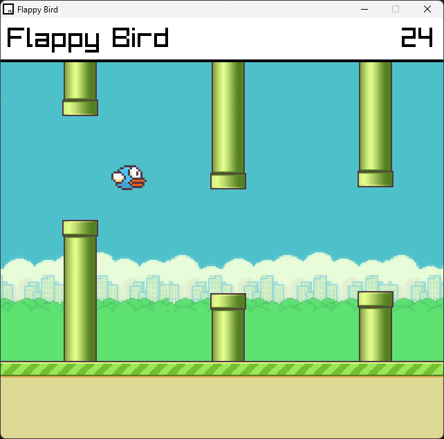
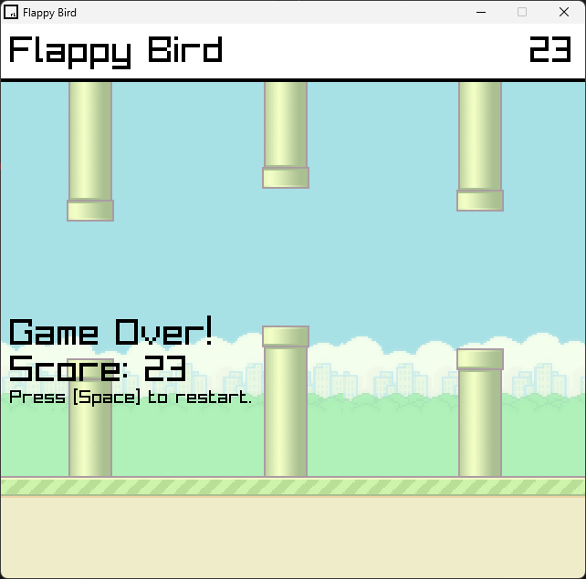
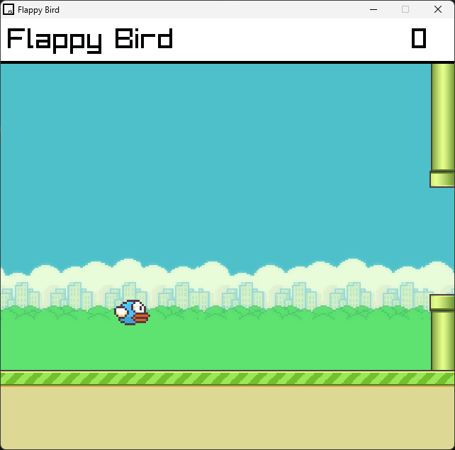

# Flappy Bird

Flappy bird built entirely using C++ and Raylib. 

The window is a small `640x480` window. The scoring is based on the number of pipes you pass.

**_Currently there is no high score mechanic._

## Test Locally
To run the game locally, you need to install Raylib. You can look at their installation instructions [here](https://github.com/raylib-extras/raylib-quickstart).

With the `MAKEFILE` provided with the installation, configure VSCode as per their instructions.

## Screenshots

